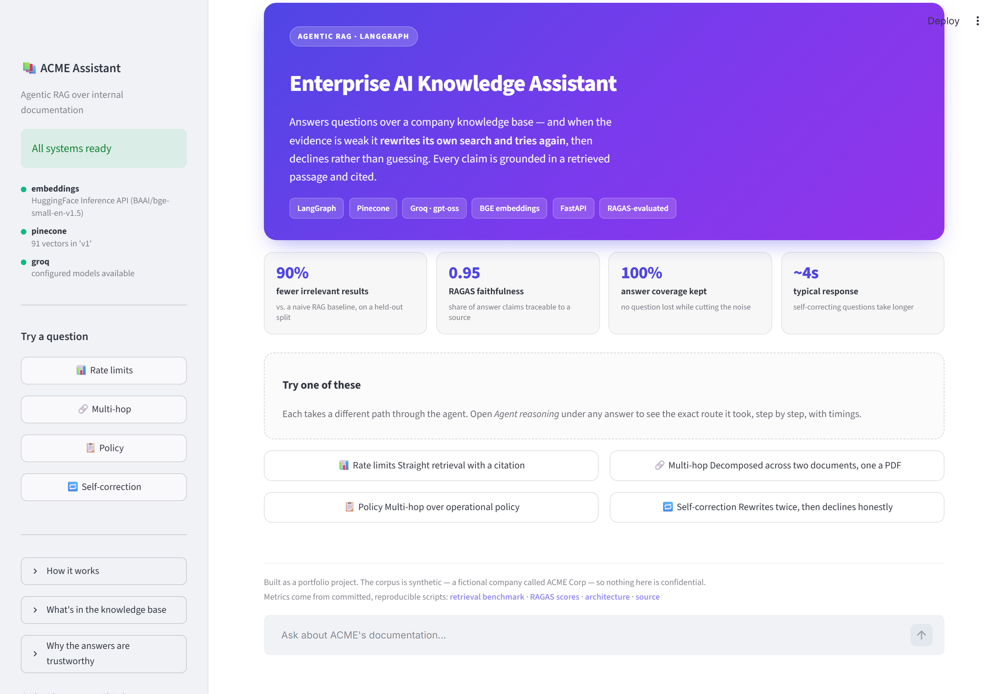
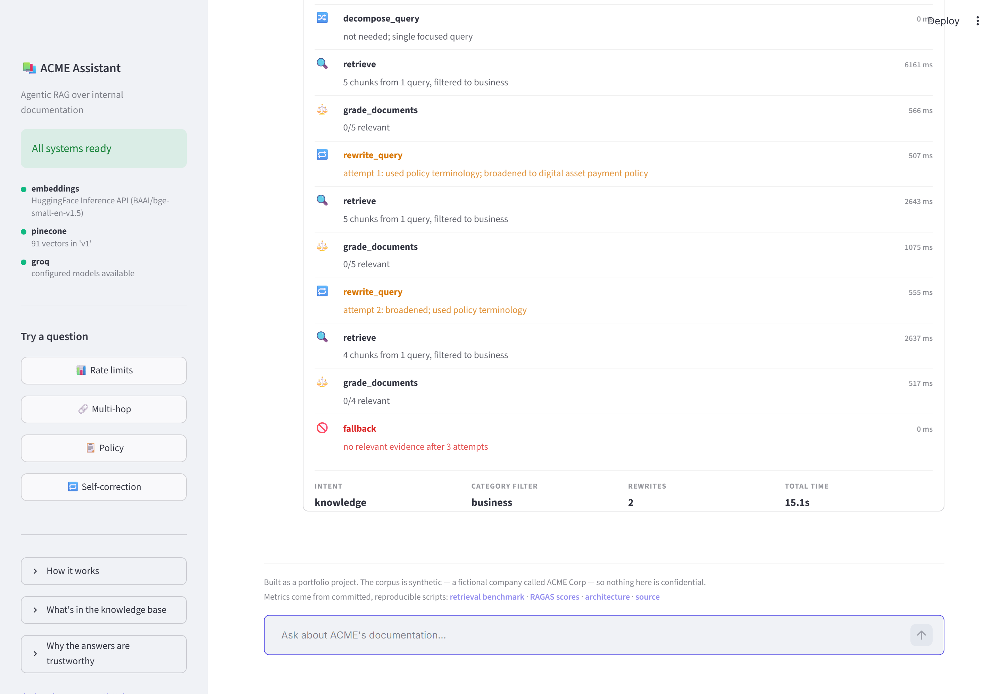
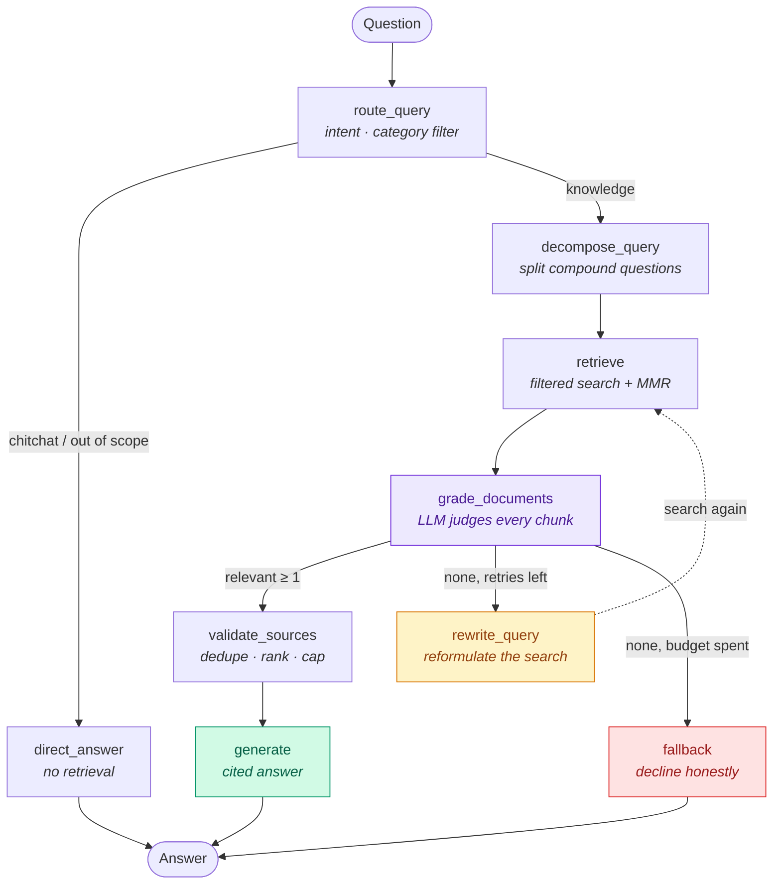
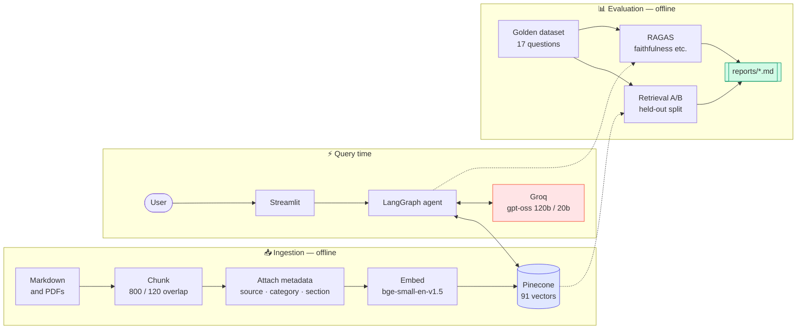
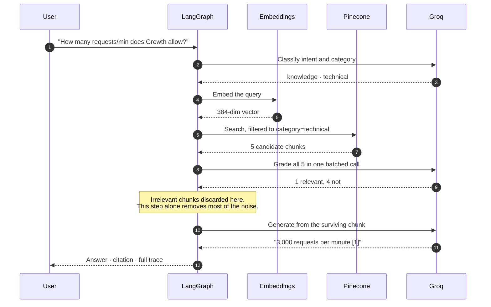
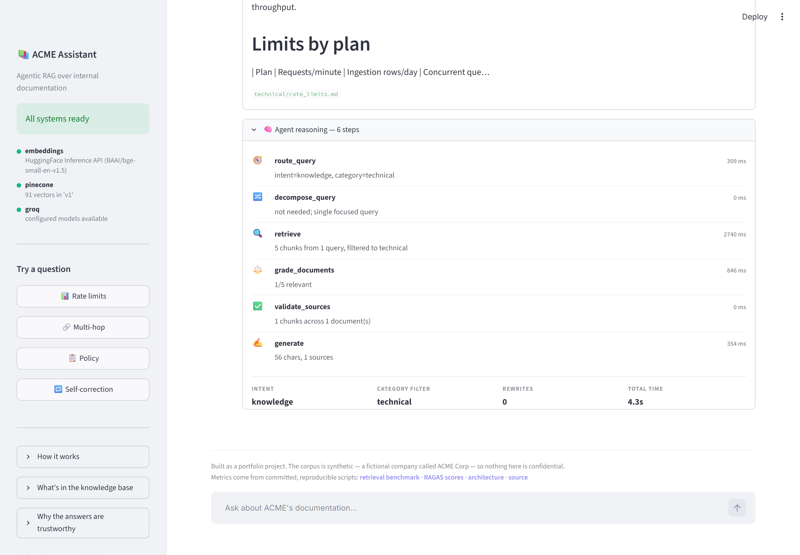

# Enterprise AI Knowledge Assistant

**An Agentic RAG system that checks its own work.** It answers questions over a company
knowledge base, grades every retrieved passage with an LLM judge, and — when the evidence
is weak — **rewrites its own search query and tries again**, declining to answer rather
than guessing when it still finds nothing.

<p align="center">
  <a href="https://enterprise-ai-assistant-rag.streamlit.app/"><b>🚀 Live demo</b></a>
  ·
  <a href="reports/retrieval_benchmark.md">Retrieval benchmark</a>
  ·
  <a href="reports/ragas_scores.md">RAGAS scores</a>
  ·
  <a href="docs/architecture.md">Architecture</a>
</p>

<p align="center">
  
  
  
  
  
  
</p>



---

## The problem this solves

A basic RAG pipeline is a straight line: embed the question, fetch the top *k* chunks,
paste them into a prompt, generate. It has no idea whether what it retrieved is any good.
When retrieval fails — and on a real corpus it fails often — the model answers confidently
from irrelevant context. That is where hallucinations come from.

This project treats retrieval as something to be **verified rather than trusted**:

| A typical RAG demo | This system |
| --- | --- |
| Retrieves once, hopes for the best | Grades every chunk with an LLM judge and discards the irrelevant ones |
| Searches with the user's words | Routes the question and filters by document category first |
| Answers from whatever came back | Rewrites the query and searches again when nothing relevant survives |
| Always produces an answer | **Declines** when the corpus genuinely cannot answer |
| Claims quality | **Measures it** — held-out benchmark and RAGAS scores, committed to the repo |

## Measured results

Everything below is produced by a committed script and written to
[`reports/`](reports/). Nothing is hand-written or estimated.

### Retrieval quality — [full report](reports/retrieval_benchmark.md)

*Irrelevant-result rate*: of the chunks placed in front of the generator, the fraction
that do not contain the answer. Measured on **7 held-out questions** the retrieval
parameters were never tuned against.

| Pipeline | Irrelevant rate | Reduction | Answer coverage |
| --- | ---: | ---: | ---: |
| Naive baseline — 512-char chunks, plain top-k, no filter | 71.4% | — | 100% |
| **+** optimized chunking and metadata filter | 68.6% | 4.0% | 100% |
| **+** MMR and a tuned score threshold | 65.2% | 8.7% | 100% |
| **+ LLM relevance grading (full pipeline)** | **7.1%** | **90.0%** | **100%** |

The complete agent puts **90% less irrelevant material in front of the generator than a
naive RAG pipeline, while still answering every question it could answer before.**
Retrieval tuning accounts for 8.7 points of that; the grading step does the rest.

### Answer quality — [full report](reports/ragas_scores.md)

| Metric | Score | What it means |
| --- | ---: | --- |
| `faithfulness` | **0.950** | 95% of claims in an answer trace back to a retrieved passage |
| `answer_relevancy` | **0.881** | Answers address the question asked |
| `context_precision` | **0.900** | The passages that mattered were ranked highly |
| `context_recall` | **1.000** | Retrieved context covered the reference answer |

Judged by Groq with local embeddings, so the evaluation costs nothing to reproduce.

---

## What makes it different: self-correction

Ask something the corpus cannot answer and watch the agent work. It searches, judges the
results useless, **reformulates its own query**, searches again, and after exhausting its
retry budget it says so plainly instead of inventing an answer.



```
🧭 route_query        intent=knowledge, category=business              1769 ms
🔀 decompose_query    not needed; single focused query                    0 ms
🔍 retrieve           5 chunks from 1 query, filtered to business      6161 ms
⚖️ grade_documents    0/5 relevant                                      566 ms
🔁 rewrite_query      attempt 1: broadened to digital asset payment…    507 ms
🔍 retrieve           5 chunks from 1 query, filtered to business      2643 ms
⚖️ grade_documents    0/5 relevant                                     1075 ms
🔁 rewrite_query      attempt 2: broadened; used policy terminology     555 ms
🔍 retrieve           4 chunks from 1 query, filtered to business      2637 ms
⚖️ grade_documents    0/4 relevant                                      517 ms
🚫 fallback           no relevant evidence after 3 attempts               0 ms
```

Every answer exposes this trace in the UI, so the reasoning is inspectable rather than
asserted.

---

## Architecture

### The agent workflow

The heart of the system is a **LangGraph state machine with a cycle**. The loop back into
retrieval is what separates this from a linear pipeline.



**The loop is bounded.** `rewrite_query` increments a counter and the graph routes to
`fallback` once it reaches `MAX_QUERY_REWRITES`, so the cycle always terminates.

### System overview



### A request, end to end



For the deeper text diagrams — storage layers, failure modes, multi-tenancy — see
[`docs/architecture.md`](docs/architecture.md).

---

## How it works, step by step

**1. Ingestion** splits 20 documents into 91 chunks using markdown-aware recursive
splitting, so a chunk boundary lands on a section or paragraph rather than mid-sentence.
Each chunk gets `source`, `category`, `doc_title` and `section` metadata, plus a
deterministic `chunk_id` that makes re-ingestion idempotent. A **contextual header** is
prepended before embedding — a chunk saying *"Hold the canary for 15 minutes"* means
nothing without *"Deployment Runbook › Canary"* attached to it.

**2. Routing** classifies the question and picks a category filter, so an HR question
never competes against API documentation. When the router is unsure it emits no filter —
a wrong filter hides the answer entirely, which is far worse than a noisier search.

**3. Retrieval** over-fetches 20 candidates, applies a cosine floor, and selects the top 5
by Maximal Marginal Relevance.

**4. Grading** is where most of the improvement comes from. An LLM judges all retrieved
chunks in a **single batched call** and the irrelevant ones are dropped before the
generator ever sees them.

**5. Generation** is constrained to the surviving passages and must cite them with `[n]`
markers that map to the source cards in the UI.

**6. Self-correction** triggers when nothing survives grading: the query is reformulated
using the documentation's vocabulary rather than the user's, and retrieval runs again.



---

## Tech stack

| Layer | Choice | Why |
| --- | --- | --- |
| Orchestration | **LangGraph 1.2** | An explicit state machine with cycles — required for the retry loop |
| LLM | **Groq** `gpt-oss-120b` / `gpt-oss-20b` | Free and fast. The small model routes and grades (most of the volume), the large one generates |
| Embeddings | **BAAI/bge-small-en-v1.5** | 384-dim, strong retrieval quality. Runs locally *or* via the HuggingFace API — identical vectors either way |
| Vector DB | **Pinecone Serverless** | Free tier, metadata filtering, no infrastructure |
| API | **FastAPI** | Async, typed, with SSE progress streaming |
| UI | **Streamlit** | Chat, citation cards, and the agent-trace inspector |
| Evaluation | **RAGAS 0.4** | Faithfulness, relevancy, context precision and recall |

> **Note on models.** Groq has retired its Llama 3 chat models. `python -m src.agent.graph --check`
> validates the configured model ids against the live API and lists the alternatives if
> they are gone.

---

## Quickstart

Requires Python 3.12, a free [Groq key](https://console.groq.com/keys) and a free
[Pinecone key](https://app.pinecone.io). Neither needs a card.

```bash
git clone https://github.com/mohankrishnaganne/Enterprise-AI-Knowledge-Assistant.git
cd Enterprise-AI-Knowledge-Assistant

python -m venv .venv && .venv/Scripts/activate      # Windows
python -m venv .venv && source .venv/bin/activate   # macOS / Linux

pip install -r requirements-dev.txt
cp .env.example .env    # add GROQ_API_KEY and PINECONE_API_KEY
```

Build the index and check it:

```bash
python scripts/generate_corpus.py
python scripts/run_ingestion.py --both
python scripts/verify_ingestion.py
```

Ask a question with no web layer at all:

```bash
python -m src.agent.graph "What is ACME's incident escalation policy?"
```

Run the app — backend and frontend, two terminals:

```bash
uvicorn api.main:app --reload --port 8000
```

```bash
streamlit run ui/app.py
```

Or the whole thing in Docker:

```bash
docker compose up --build
```

Reproduce the published numbers:

```bash
python scripts/benchmark_retrieval.py
python scripts/run_ragas_eval.py
```

---

## API

| Endpoint | Purpose |
| --- | --- |
| `POST /chat` | Answer a question. Returns the answer, citations, the agent's `trace`, `rewrites`, and `insufficient_evidence` |
| `POST /chat/stream` | The same, as server-sent events — one event per agent step, then the result |
| `GET /health` | Liveness. Cheap, no external calls |
| `GET /ready` | Readiness. Reports embeddings, Pinecone (with vector count) and Groq individually |
| `GET /docs` | Interactive OpenAPI documentation |

```bash
curl -X POST localhost:8000/chat -H 'Content-Type: application/json' \
  -d '{"question":"How many API requests per minute does the Growth plan allow?"}'
```

`/chat/stream` streams **agent progress rather than tokens**. A self-correcting request
takes ~10 seconds; watching `retrieve → grade → rewrite` arrive live is what makes the
wait legible.

---

## How the numbers were measured honestly

The benchmark contradicted the initial design twice, and both findings are kept in the
report rather than tuned away.

- **Held-out test split.** Retrieval parameters are tuned on 8 questions and reported on
  a disjoint 7. Tuning and reporting on the same questions would overfit badly at this
  sample size.
- **Fixed *k* across arms.** Only ~1.6 chunks per question contain the answer, so
  precision falls mechanically as *k* grows. An earlier version compared *k*=5 against
  *k*=6 and reported the optimized pipeline as **worse** — an artifact of *k*, not a
  property of the retriever.
- **No oracle router.** Filtered arms use the live LLM router, so its mistakes count
  against the optimized pipeline exactly as they do in production.
- **Answer coverage reported beside every precision figure**, because a retriever that
  simply returns fewer chunks would otherwise look like an improvement.
- **MMR measurably hurt** on this corpus and the tuner turned it off; the original score
  threshold of 0.35 was a **no-op** because every cosine score sat above it.
- **Small sample.** 7 held-out questions shows a direction, not a confidence interval.

---

## Repository layout

```
src/ingestion/     loading, chunking, metadata enrichment, upsert pipeline
src/retrieval/     embeddings (local or hosted), Pinecone client, retrievers
src/agent/         LangGraph state, prompts, schemas, nodes, compiled graph
src/evaluation/    golden dataset, RAGAS harness, retrieval metrics
api/               FastAPI app
ui/                Streamlit client, shared presentation, theme
streamlit_app.py   Streamlit Cloud entrypoint (agent runs in-process)
scripts/           corpus generation, ingestion, evaluation, benchmark, screenshots
reports/           generated, committed evidence
docs/              architecture and images
tests/             122 tests, no API keys required
```

## Testing

```bash
pytest              # 122 tests — the LLM and vector store are mocked
ruff check .
ruff format --check .
```

CI runs the suite, shellcheck, a CRLF guard, a Docker build that asserts the image
contains the baked model and corpus, and a job that resolves the deployment requirements
on Python 3.14 and **fails if torch ever reappears** in them.

## Deployment

| Target | Command |
| --- | --- |
| Local, two services | `docker compose up --build` |
| Single container | `docker build -t acme-assistant . && docker run -p 7860:7860 --env-file .env acme-assistant` |
| Streamlit Cloud | Point it at `streamlit_app.py` — see [`deploy/README.md`](deploy/README.md) |

The deployed app uses **hosted embeddings** via the HuggingFace Inference API rather than
a local model. It serves the same `bge-small-en-v1.5` and returns identical vectors
(verified at cosine 1.000000), so the same Pinecone index is queried and the benchmark
numbers above describe the live deployment — but it removes torch from the runtime, which
is what makes the app fit a free tier at all.

---

## Notes

The corpus is **synthetic** — a fictional company called ACME Corp — so nothing here is
confidential. It spans technical documentation (API reference, runbooks, schemas),
operational policy (onboarding, incident response, on-call, security) and business
material (pricing, quarterly review, competitors, roadmap). Two documents are PDFs, so
that ingestion path is genuinely exercised rather than assumed.

Screenshots in this README are regenerated with
`python scripts/capture_screenshots.py`, so they cannot drift from the interface.
